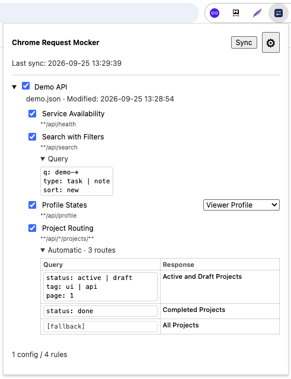

# Chrome Request Mocker

Chrome extension for mocking JSON API endpoints. It intercepts `fetch` and XHR requests and returns responses defined in local JSON configuration files — without a mock server or proxy.

Configs stay on your device, so you can edit them in your IDE, keep them in Git, or ask a coding agent to modify them.

> 100% vibe-coded. Bugs are guaranteed.

## Showcase



## Install

1. Clone or download this repository.
2. Open `chrome://extensions`.
3. Enable **Developer mode**.
4. Click **Load unpacked** and select the extension directory.
5. Open the extension settings and select a folder with your mock configs.
6. Click **Sync from folder**.
7. Enable the configs and rules you need in the popup.
8. Reload your application.

## Examples

### Combining `*` and `**` in URL patterns

`*` matches characters inside one path segment, while `**` can cross `/`. They can be used together:

```text
**/api/organizations/*/projects/**
```

Matches:

```text
https://example.com/api/organizations/42/projects/active
https://example.com/internal/api/organizations/demo/projects/42/members
```

Does not match:

```text
https://example.com/api/organizations/team/backend/projects/active
https://example.com/api/organizations/42/users/active
```

URL patterns are matched against the complete absolute URL without query parameters or hash.

### One response

The simplest rule returns one fixed response. It can optionally restrict requests by HTTP method and query parameters:

```json
{
  "id": "demo",
  "name": "Demo API",
  "rules": [
    {
      "id": "projects-search",
      "name": "Project search",
      "pattern": "**/api/projects",
      "methods": ["GET"],
      "query": [
        {
          "status": ["active", "draft"],
          "search": "project-*"
        },
        {
          "preview": "?"
        }
      ],
      "response": {
        "status": 200,
        "body": {
          "items": []
        }
      }
    }
  ]
}
```

Matches:

```text
GET https://example.com/api/projects?status=active&search=project-one
GET https://example.com/api/projects?search=project-a%2Fb&status=draft&limit=20
GET https://example.com/api/projects?preview=
GET https://example.com/api/projects?preview=x
```

Does not match:

```text
GET  https://example.com/api/projects?status=archived&search=project-one
GET  https://example.com/api/projects?status=active
GET  https://example.com/api/projects?preview=xy
POST https://example.com/api/projects?status=active&search=project-one
```

Objects in `query` are alternatives. Conditions inside one object must all match. Query values support `*`, `?`, and `+` patterns; see the [configuration reference](docs/configuration.md) for their exact semantics and escaping rules.

### Manually selected responses

Use `responses` without `routes` to switch between predefined responses from the popup:

```json
{
  "id": "projects-list",
  "name": "Projects list",
  "pattern": "**/api/projects",
  "methods": ["GET"],
  "responses": [
    {
      "id": "empty",
      "name": "Empty",
      "body": {"items": []}
    },
    {
      "id": "results",
      "name": "With results",
      "body": {"items": [{"id": 1}, {"id": 2}]}
    }
  ]
}
```

| Popup selection | Returned body |
| --- | --- |
| `Empty` | `{"items":[]}` |
| `With results` | `{"items":[{"id":1},{"id":2}]}` |

The selection is stored by response ID and is preserved when responses are reordered.

### Automatic query routing

Add ordered `routes` when the request query parameters should select the response automatically:

```json
{
  "id": "projects-list",
  "name": "Projects list",
  "pattern": "**/api/projects",
  "methods": ["GET"],
  "responses": [
    {
      "id": "active_response_id",
      "body": {"items": ["active"]}
    },
    {
      "id": "archived_response_id",
      "body": {"items": ["archived"]}
    },
    {
      "id": "fallback_response_id",
      "body": {"items": []}
    }
  ],
  "routes": [
    {
      "query": [{"status": ["active", "draft"]}],
      "responseId": "active_response_id"
    },
    {
      "query": [{"status": "archived"}],
      "responseId": "archived_response_id"
    },
    {
      "responseId": "fallback_response_id"
    }
  ]
}
```

| Request | Selected response |
| --- | --- |
| `GET /api/projects?status=active` | `active_response_id` |
| `GET /api/projects?status=draft` | `active_response_id` |
| `GET /api/projects?status=archived` | `archived_response_id` |
| `GET /api/projects?status=unknown` | `fallback_response_id` |
| `GET /api/projects` | `fallback_response_id` |

Routes are checked in array order. A an optional final route without `query` acts as the fallback.

## Sync workflow

After changing config files, click **Sync** in the popup and reload the application page. Use Settings to choose the folder initially or change it later.

Configs and individual rules can be enabled or disabled from the popup. Invalid files fail the complete sync and leave the previously imported snapshot unchanged.

## Documentation

- [Configuration reference](docs/configuration.md)
- [Breaking changes history](docs/breaking-changes.md)
- [Limitations and troubleshooting](docs/limitations.md)
