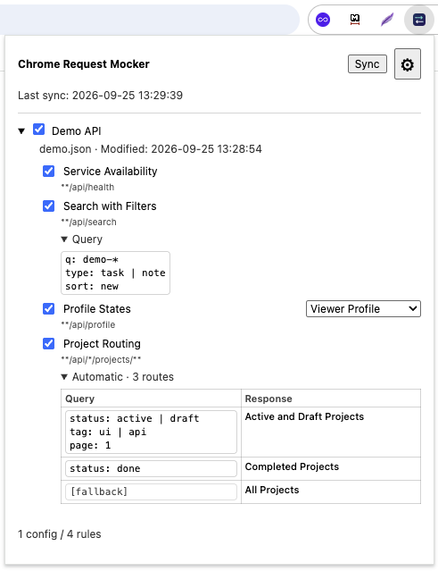

# Chrome Request Mocker

Chrome extension for mocking JSON API endpoints. It intercepts `fetch` and XHR requests and returns responses defined in local JSON configuration files — without a mock server or proxy.

Configs stay on your device, so you can edit them in your IDE, keep them in Git, or ask a coding agent to modify them.

> 100% vibe-coded. Bugs are guaranteed.

## Showcase



## Install

1. Clone or download this repository.
2. Open `chrome://extensions`.
3. Enable **Developer mode**.
4. Click **Load unpacked** and select the extension directory.
5. Open the extension settings and select a folder with your mock configs.
6. Click **Sync from folder**.
7. Enable the configs and rules you need in the popup.
8. Changes apply to open pages after sync; no reload is required.

## Features

Configs can declare inputs with optional `default` values and use `$[[name]]` templates; URL captures and inputs share one namespace. Defaults fill missing values on sync; saved values stay local and take precedence. Unsaved edits are restored if the popup closes. See [inputs and templates](docs/configuration.md#inputs-and-templates).

Use `"type": "datetime"` for a fixed date or `"type": "relative-datetime"` for current time with an offset in seconds; set the output `format` in the config. Relative dates stay fixed between requests; **Refresh relative time** button recalculates them together. See [date and time inputs](docs/configuration.md#date-and-time-inputs).

Rules and individual responses can set a fixed `delay` in milliseconds or a random range such as `{ "min": 200, "max": 800 }`. A response's delay overrides the rule's delay. See [response delay](docs/configuration.md#response-delay).

## Examples

The first example is a complete config file. The remaining JSON snippets are individual rules to add to its `rules` array.

### Minimal config

This config returns an empty project list for GET requests to `/api/projects`:

```json
{
  "id": "demo",
  "name": "Demo API",
  "rules": [
    {
      "id": "projects-list",
      "pattern": "**/api/projects",
      "methods": ["GET"],
      "response": {
        "body": { "items": [] }
      }
    }
  ]
}
```

### Combining `*` and `**` in URL patterns

`*` matches characters inside one path segment, while `**` can cross `/`. They can be used together:

```text
**/api/organizations/*/projects/**
```

Matches:

```text
https://example.com/api/organizations/42/projects/active
https://example.com/internal/api/organizations/demo/projects/42/members
```

Does not match:

```text
https://example.com/api/organizations/team/backend/projects/active
https://example.com/api/organizations/42/users/active
```

URL patterns are matched against the complete absolute URL without query parameters or hash.
Use `{id}` to capture one non-empty path segment or `{path:**}` to capture zero or more characters, including `/`. Captures can be used in query/params conditions and response content; see the [configuration reference](docs/configuration.md#url-patterns).

### Query conditions

Add `query` conditions to restrict which requests a rule matches:

```json
{
  "id": "projects-search",
  "name": "Project search",
  "pattern": "**/api/projects",
  "methods": ["GET"],
  "query": [
    {
      "status": ["active", "draft"],
      "search": "project-*"
    },
    {
      "preview": "?"
    }
  ],
  "response": {
    "body": { "items": [] }
  }
}
```

Matches:

```text
GET https://example.com/api/projects?status=active&search=project-one
GET https://example.com/api/projects?search=project-a%2Fb&status=draft&limit=20
GET https://example.com/api/projects?preview=
GET https://example.com/api/projects?preview=x
```

Does not match:

```text
GET  https://example.com/api/projects?status=archived&search=project-one
GET  https://example.com/api/projects?status=active
GET  https://example.com/api/projects?preview=xy
POST https://example.com/api/projects?status=active&search=project-one
```

Objects in `query` are alternatives. Conditions inside one object must all match. Query values support `*`, `?`, and `+` patterns; see the [configuration reference](docs/configuration.md) for their exact semantics and escaping rules.

### Manually selected responses

Use `responses` without `routes` to switch between predefined responses from the popup:

```json
{
  "id": "projects-list",
  "name": "Projects list",
  "pattern": "**/api/projects",
  "methods": ["GET"],
  "responses": [
    {
      "id": "empty",
      "name": "Empty",
      "body": {"items": []}
    },
    {
      "id": "results",
      "name": "With results",
      "body": {"items": [{"id": 1}, {"id": 2}]}
    }
  ]
}
```

| Popup selection | Returned body |
| --- | --- |
| `Empty` | `{"items":[]}` |
| `With results` | `{"items":[{"id":1},{"id":2}]}` |

The selection is stored by response ID and is preserved when responses are reordered.

### Automatic query routing

Add ordered `routes` when the request query parameters should select the response automatically:

```json
{
  "id": "projects-list",
  "name": "Projects list",
  "pattern": "**/api/projects",
  "methods": ["GET"],
  "responses": [
    {
      "id": "active_response_id",
      "body": {"items": ["active"]}
    },
    {
      "id": "archived_response_id",
      "body": {"items": ["archived"]}
    },
    {
      "id": "fallback_response_id",
      "body": {"items": []}
    }
  ],
  "routes": [
    {
      "query": [{"status": ["active", "draft"]}],
      "responseId": "active_response_id"
    },
    {
      "query": [{"status": "archived"}],
      "responseId": "archived_response_id"
    },
    {
      "responseId": "fallback_response_id"
    }
  ]
}
```

| Request | Selected response |
| --- | --- |
| `GET /api/projects?status=active` | `active_response_id` |
| `GET /api/projects?status=draft` | `active_response_id` |
| `GET /api/projects?status=archived` | `archived_response_id` |
| `GET /api/projects?status=unknown` | `fallback_response_id` |
| `GET /api/projects` | `fallback_response_id` |

Routes are checked in array order. A route without `query` and `params` acts as fallback; at most one is allowed, and it must be last.

### Path captures in routes

Capture a path and use it to match query values and build a response:

```json
{
  "id": "team-files",
  "pattern": "**/teams/{id}/files/{path:**}",
  "responses": [{ "id": "file", "body": { "team": "$[[id]]", "path": "$[[path]]" } }],
  "routes": [{
    "params": [{ "id": ["alpha", "beta"], "path": "*.json" }],
    "query": [{ "owner": "$[[id]]" }],
    "responseId": "file"
  }]
}
```

For example, `/teams/alpha/files/reports/daily.json?owner=alpha` returns `{"team":"alpha","path":"reports/daily.json"}`. Both `params` and `query` must match.

Capture names must not conflict with inputs; rename conflicting names to make the config valid.

## Sync workflow

After changing config files, click **Sync** in the popup. Changes apply to open pages immediately. Use Settings to choose the folder initially or change it later.

Configs and individual rules can be enabled or disabled from the popup. Invalid files fail the complete sync and leave the previously imported snapshot unchanged.

The extension icon badge shows the number of enabled, complete configs currently loaded by the runtime. An empty badge means that no configs are active.

## Documentation

- [Configuration reference](docs/configuration.md)
- [Breaking changes history](docs/breaking-changes.md)
- [Limitations and troubleshooting](docs/limitations.md)
